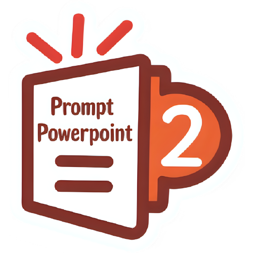
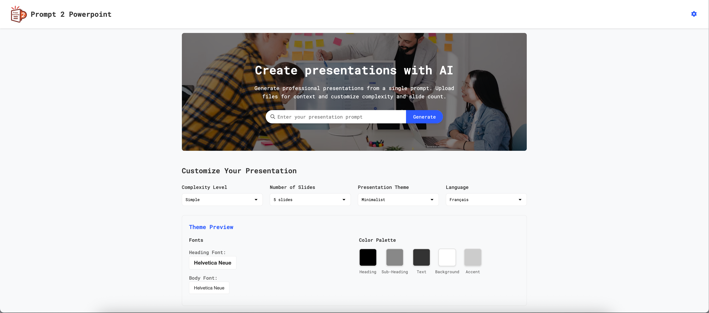
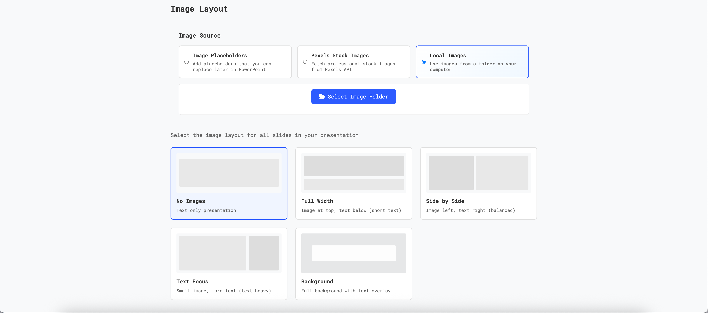
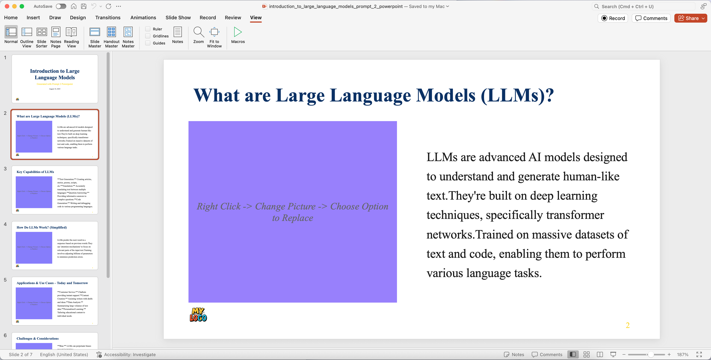

# Prompt 2 Powerpoint

<p align="center">
  
</p>

<p align="center">
  
</p>

A powerful AI-driven web application that generates professional PowerPoint presentations using LLM APIs. Support for both privacy-focused local LLM servers and cloud-based OpenRouter API, with optional real image integration via Pexels.

## 🚀 Key Features

### Core Functionality
- **Multi-Provider AI Generation**: Choose between local LLM servers or OpenRouter cloud API
- **Privacy-First Options**: Keep your data completely private with local LLM processing
- **Smart Context Understanding**: Upload PDF/text files for context-aware presentations
- **Real Stock Images**: Optional integration with Pexels API for professional imagery
- **Theme System**: 6 professionally designed themes including a fully customizable option
- **Interactive Editing**: Add custom slides at any position post-generation
- **Real-time Preview**: See your presentation as it's being created
- **Instant Download**: Export as standard PPTX files compatible with PowerPoint

### Image Generation Options
1. **No Images**: Clean, text-only presentations for maximum focus
2. **Image Placeholders**: Transparent placeholders that can be manually replaced in PowerPoint
3. **Real Images** (Experimental): AI-selected stock photos from Pexels based on slide content

### Image Layouts (when images are enabled)
- **Full Width**: Image at top, text content below
- **Side by Side**: Image on left, text on right
- **Text Focus**: Small image on right, more space for text
- **Background**: Full background image with semi-transparent text overlay

## 🔒 Privacy & Security

For maximum privacy, use:
- **Local LLM** via LM Studio or compatible server
- **Image Placeholders** instead of real images
- All processing happens in your browser - no data sent to external servers (except when using cloud options)

## 📸 Screenshots

### Configuration
<table>
  <tr>
    <td align="center">
      <br>
      <b>Local LLM Configuration</b>
    </td>
    <td align="center">
      <br>
      <b>OpenRouter & Pexels API Setup</b>
    </td>
  </tr>
</table>

### Presentation Creation
<table>
  <tr>
    <td align="center">
      <br>
      <b>Presentation Configuration</b>
    </td>
    <td align="center">
      <br>
      <b>Image Layout Selection</b>
    </td>
  </tr>
  <tr>
    <td align="center">
      <br>
      <b>PDF Context Upload</b>
    </td>
    <td align="center">
      <br>
      <b>Real-time Generation Progress</b>
    </td>
  </tr>
</table>

### Preview & Management
<table>
  <tr>
    <td align="center">
      <br>
      <b>Interactive Slide Preview</b>
    </td>
</table>

### Custom Slide Addition
<table>
  <tr>
    <td align="center">
      <br>
      <b>Add Slide Interface</b>
    </td>
    <td align="center">
      <br>
      <b>Custom Slide Creation</b>
    </td>
  </tr>
  <tr>
    <td align="center">
      <br>
      <b>Newly Added Slide</b>
    </td>
</table>

### Generated Presentation Example
<table>
  <tr>
    <td align="center">
      <br>
      <b>Complete Presentation</b>
    </td>
    <td align="center">
      <br>
      <b>Slide Details View</b>
    </td>
  </tr>
</table>

## 🚀 Getting Started

### Option 1: Local LLM (Recommended for Privacy)
1. **Install LM Studio** or any OpenAI-compatible local LLM server
2. Start your local server (default: `http://127.0.0.1:1234`)
3. Open `index.html` in your browser
4. The app will automatically connect to your local server

### Option 2: OpenRouter API (Recommended for Large Context)
1. Get your API key from <a href="https://openrouter.ai/keys" target="_blank">OpenRouter</a> (includes free credits)
2. Open the app and go to Settings
3. Switch to "OpenRouter" provider
4. Enter your API key
5. Select from available cloud models

### Option 3: Real Images with Pexels (Optional)
1. Get a free API key from <a href="https://www.pexels.com/api/" target="_blank">Pexels</a>
2. Add the key in Settings
3. Toggle "Use Real Images" in the image options

## 📝 Usage Guide

### Creating Your First Presentation

1. **Choose Your Setup**:
   - Select provider (Local LLM or OpenRouter)
   - Choose image preference (None, Placeholders, or Real Images)
   - Pick a theme from 6 options (including Custom for full control)

2. **Provide Context**:
   - Enter a detailed prompt describing your presentation
   - **Upload PDFs** for additional context (recommended for complex topics)
   - The AI will extract key information from your files

3. **Configure Generation**:
   - **Complexity**: Simple (basic), Standard (balanced), or Detailed (comprehensive)
   - **Slide Count**: 5-20 slides
   - **Theme**: Choose from 6 options including Custom
   - **Model**: Select based on your provider

4. **Generate & Download**:
   - Click Generate and watch real-time progress
   - Preview slides in the interactive grid
   - Download as PPTX when complete

### Custom Slide Addition (Recommended Feature!)

Perfect for adding custom flow to your presentations:

1. **Find Insert Points**: Look for ➕ icons between slides
2. **Click to Add**: Choose exact position for new content
3. **AI-Powered Generation**: New slides maintain consistent style and context
4. **Instant Preview**: See changes immediately
5. **Seamless Integration**: Download includes all custom additions

### Custom Theme Creation

Create your own personalized theme with complete control:

1. **Select Custom Theme**: Choose "Custom" from the theme dropdown
2. **Interactive Controls**: The theme preview becomes interactive
3. **Font Selection**: Choose from 12 fonts for headings and body text
4. **Color Customization**: Click any color swatch to open a color picker
5. **Real-time Preview**: See changes instantly as you customize
6. **Persistent Settings**: Your custom theme saves automatically

## 💡 Recommendations

### For Best Results:
- **Use OpenRouter with PDF uploads** for presentations requiring large context
- **Use Local LLM with placeholders** for maximum privacy
- **Enable real images** only for final presentations (experimental)
- **Upload relevant PDFs** to improve content accuracy
- **Use the single slide add feature** to customize presentation flow

### Provider Comparison:
| Feature | Local LLM | OpenRouter |
|---------|-----------|------------|
| Privacy | ✅ Complete | ⚠️ Cloud-based |
| Context Length | Limited | ✅ Large |
| Speed | Varies | ✅ Fast |
| Cost | ✅ Free | Free credits + paid |
| Model Selection | Limited | ✅ Many options |

## 🛠️ Technical Details

### Architecture
- **Pure Vanilla JavaScript**: No build process, no npm required
- **Modular Design**: Clean separation of concerns across modules
- **Client-Side Processing**: All operations happen in your browser
- **CDN Dependencies**: External libraries loaded from CDNs

### Core Modules
- `app.js` - Main application controller
- `api.js` - Multi-provider LLM communication
- `fileHandler.js` - PDF/text file processing
- `presentationBuilder.js` - PPTX generation with themes
- `ui.js` - User interface management
- `pexelsClient.js` - Stock image integration

### API Integrations
1. **Local LLM Server**
   - OpenAI-compatible endpoints
   - Streaming support for real-time generation

2. **OpenRouter API**
   - Access to multiple cloud models
   - Built-in rate limiting and error handling

3. **Pexels API**
   - Smart query optimization
   - Intelligent caching system
   - Rate limit: 180 requests/hour

### External Dependencies
All loaded via CDN - no installation required:
- `pptxgenjs` v3.12.0 - PowerPoint generation
- `pdf.js` v3.11.174 - PDF parsing
- `SweetAlert2` v11 - Enhanced dialogs
- `Font Awesome` v6.4.0 - Icons

## 🧪 Test Resources

Try the application with our sample PDF:
- **<a href="assets/PDF_file_uploaded.pdf" target="_blank">Sample PDF Document</a>** - Use this file to test the PDF upload and context extraction features

Presentation generated using the sample PDF as Local LLM gemma-3-27b-it
- **<a href="assets/a_beginner_s_guide_to_large_language_models_prompt_2_powerpoint.pptx" target="_blank"> Generated Presentation</a>** - Presentation Settings: Simple/5 Slides/Professional Theme/Side-by-Side Image Placeholder Layout. Added Single Slide - Local LLM vs Cloud LLM API

### How to Test:
1. Download or directly drag the sample PDF into the upload area
2. Add a prompt like "Create a presentation based on this document"
3. The AI will extract key information and generate relevant slides

## 📋 Requirements

- Modern web browser (Chrome 80+, Firefox 75+, Safari 13+, Edge 80+)
- JavaScript enabled
- Internet connection (for CDN resources and cloud APIs)
- Optional: Local LLM server for privacy mode

## 🎯 Quick Start Examples

### Example 1: Company Overview Presentation
```
Prompt: "Create a 10-slide presentation about our sustainable technology startup"
Settings: OpenRouter, Standard complexity, Theme: Modern, Real Images
Upload: company-overview.pdf
```

### Example 2: Training Material
```
Prompt: "Design a training presentation on cybersecurity best practices"
Settings: Local LLM, Detailed complexity, Theme: Professional, Placeholders
Upload: security-guidelines.pdf
```

### Example 3: Sales Pitch
```
Prompt: "Generate a sales pitch for our new AI-powered analytics platform"
Settings: OpenRouter, Simple complexity, Theme: Corporate, Real Images
Custom slides: Add specific client case studies using the + button
```

### Example 4: Custom Branded Presentation
```
Prompt: "Create a presentation about our quarterly results"
Settings: Local LLM, Standard complexity, Theme: Custom, Placeholders
Custom theme: Brand colors (#1E3A8A primary, #F59E0B accent), Roboto font
```

## 🌟 Latest Updates

- **Custom Theme Feature**: Create personalized themes with interactive controls
- **Theme System**: 6 themes including fully customizable option
- **Single Slide Addition**: Context-aware custom slide insertion
- **Multi-Provider Support**: Seamless switching between local and cloud
- **Improved Layouts**: Image layout options including background mode

## 📁 Project Structure

```
prompt-2-powerpoint/
├── index.html           # Main application
├── css/
│   └── styles.css      # Responsive styling
├── js/
│   ├── app.js          # Application controller
│   ├── api.js          # LLM provider management
│   ├── fileHandler.js  # PDF/text processing
│   ├── presentationBuilder.js # PPTX generation
│   ├── ui.js           # Interface management
│   └── pexelsClient.js # Image API integration
└── README.md           # This file
```

## 🤝 Contributing

This is a client-side application with no backend. To contribute:
1. Fork the repository
2. Make your changes
3. Test thoroughly with both local and cloud providers
4. Submit a pull request

## 📄 License

This project is licensed under the MIT License - see the [LICENSE](LICENSE) file for details.

---

**Note**: This application processes all data locally in your browser. When using cloud services (OpenRouter, Pexels), please review their respective privacy policies.
